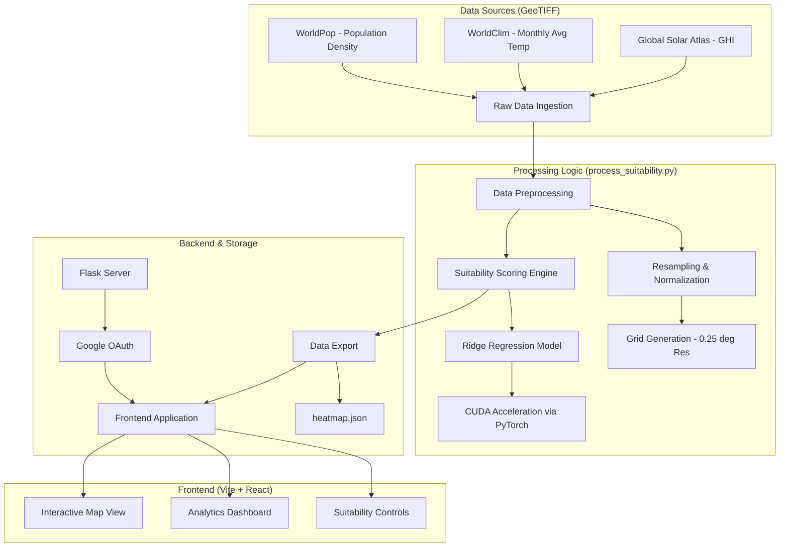

# SharkTech 2.0 - Global Datacenter Suitability Heatmap

SharkTech 2.0 is a cutting-edge decision-support tool designed to identify optimal locations for datacenters worldwide. By synthesizing multi-source geospatial data including climate patterns, population density, and renewable energy potential, the platform provides a comprehensive suitability index to guide infrastructure investment.

## 🚀 Key Features

- **Multi-Factor Suitability Index**: Evaluates locations based on environmental efficiency, population impact, and renewable energy availability.
- **Interactive Global Heatmap**: High-resolution visualization of suitability scores across the globe.
- **Micro-Analysis Panel**: Detailed breakdown of individual scores (Environmental, Population, Renewable) for any selected coordinate.
- **CUDA-Accelerated Data Pipeline**: High-performance processing of global raster datasets using PyTorch.
- **Sleek, Dark UI**: A professional dashboard built with modern web aesthetics.

## 🏗️ Technical Architecture

The following diagram illustrates the flow of data from raw ingestion to frontend visualization:



## 🛠️ Tech Stack

### Frontend
- **Framework**: [React](https://reactjs.org/) + [Vite](https://vitejs.dev/)
- **Styling**: [Tailwind CSS](https://tailwindcss.com/) + [Radix UI](https://www.radix-ui.com/)
- **Charts**: [Recharts](https://recharts.org/)
- **Icons**: [Lucide React](https://lucide.dev/)

### Backend
- **Framework**: [Flask](https://flask.palletsprojects.com/)
- **Authentication**: Google OAuth 2.0
- **Environment Management**: Python-dotenv, Flask-CORS

### Data Pipeline
- **Core Processing**: [NumPy](https://numpy.org/), [Pandas](https://pandas.pydata.org/)
- **Geospatial**: [Rasterio](https://rasterio.readthedocs.io/), [Rioxarray](https://corteva.github.io/rioxarray/)
- **ML & Hardware Acceleration**: [Scikit-learn](https://scikit-learn.org/), [PyTorch](https://pytorch.org/) (CUDA)

## ⚙️ Project Structure

- `frontend/`: React-based dashboard application.
- `src/`: Core Python modules for grid generation and visualization.
- `data/raw/`: Directory for input GeoTIFF datasets.
- `process_suitability.py`: The main data processing pipeline.
- `app.py`: Legacy/Static analysis entry point.
- `server.py`: Flask backend providing authentication and API services.

## 🏁 Getting Started

### 1. Data Processing
Ensure you have the raw GeoTIFF files in `data/raw/`. Then run the pipeline:
```bash
python process_suitability.py
```
This will generate `frontend/public/data/heatmap.json`.

### 2. Backend Setup
```bash
# Install dependencies
pip install -r requirements.txt

# Start the Flask server
python server.py
```

### 3. Frontend Setup
```bash
cd frontend
npm install
npm run dev
```


